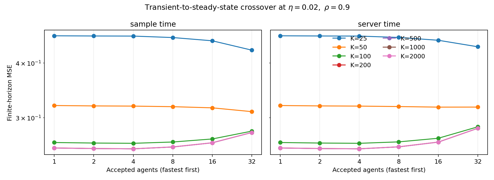

# MARL-SDDE

Low-complexity experiments for studying dependence-limited speedup under
delayed multi-agent Markov updates.

This repository currently contains the first controlled feasibility study for
a possible stochastic-approximation and reinforcement-learning theory project.
It is research code, not a released implementation of a complete MARL
algorithm.

## Current question

When agent updates contain a persistent common Markov factor, the effective
variance reduction may saturate well before the nominal number of agents. If
additional agents are also staler, the best participation level may depend on
whether learning is in its transient or stationary regime.

The scalar model is

\[
x_{k+1}
=x_k-\eta a\sum_d w_d x_{k-d}
+\eta\sqrt{\rho}\sum_d w_d c_{k-d}
+\eta\sqrt{1-\rho}\,e_k,
\]

with an alternative shared-server-time alignment for the common factor.
Deterministic delays allow exact finite-horizon and stationary mean-square
errors to be computed through an augmented linear system and a discrete
Lyapunov equation.

## Initial findings

- With synchronous agents, the finite-horizon improvement from 1 to 32 agents
  was \(22.60\times\) under independent noise but only \(1.0034\times\) when
  the common-noise fraction was \(\rho=0.9\).
- A dependence-blind delay-only tuning rule had \(1.8745\times\) the MSE of the
  joint oracle at \(\rho=0.9\).
- The pre-registered 500-step joint oracle still selected all 32 agents, so the
  stronger claim that jointly tuned learning should reject agents was not
  supported in the baseline.
- In a separate fixed-step analysis with \(\eta=0.02\), all 32 agents were best
  at 25 iterations, whereas 4 agents were best from 100 iterations onward.
  The 32-agent stationary MSE was \(11.42\%\) above the 4-agent optimum.
- In a 64-seed predictable stagewise experiment, dependence-aware control
  reduced high-correlation MSE to 36.2% of an independence-based delay-only
  controller. Jointly adapting participation did not improve MSE over retaining
  all 32 agents and adapting only the scalar step size (ratio 1.001, bootstrap
  95% interval 0.977–1.029).

The evidence therefore favors correlation-aware scalar step-size adaptation as
the current main algorithmic mechanism. Participation control requires a
communication- or wall-clock-aware objective before it can be claimed as an
additional contribution.

EXP-005A then evaluated the correct resource-aware question. In its
pre-registered matched-budget surface, the optimum changed from all 32 agents
under independent noise to one agent under strong common noise. At
\(\rho=0.9\), the optimal action used about 26% of the best all-agent MSE at
the same message budget; the direction persisted under a wall-clock proxy and
a non-fastest selection sensitivity. This is an oracle mechanism result; an
online controller that pays for probing remains the next required gate.

EXP-005B tested that gate. The charged controller selected median \(q=16\)
under independent noise and \(q\in\{1,2,4\}\) under clustered, global, and
mixed dependence. It reduced correlated-cell MSE to 34.4% of all-agent
adaptive-step control and stayed within 8.3% of the same-cost information
oracle. However, it did not beat fixed \(q=1\) after paying an 18% full-probe
budget, so the pre-registered overall gate failed.

EXP-005C replaces the full probe by 2.4% sparse probing and introduces
within-run dependence shifts. After a semantics-checked execution optimization,
the 64-seed run completed and reproduced exactly. The controller failed the
performance and switch-response gates. However, the piecewise oracle also kept
median \(q=32\) in every regime, so this rejects the implemented controller
rather than the broader participation-adaptation hypothesis.

EXP-006A resolves that mismatch with a 9,720-cell oracle phase diagram. It
finds ten reproducible regions where optimal participation changes strongly
with dependence and optimization state. The combined go/no-go still fails
because delay changes pointwise optimal participation in only 5.31% of groups.
The resulting research target is correlation/state-adaptive participation
under SDDE-governed delay, not a controller that forces every source of
heterogeneity to act through the agent count.

EXP-007A--D move this mechanism into delayed linear TD. Independent paths give
effective participation 30.996 at \(q=32\), while correlation 0.9 gives only
1.111. An exact delayed mean boundary is insufficient for stochastic
stability, so the current algorithm combines it with the aggregate random-
Jacobian second moment. In a preregistered 64-seed confirmation, all seven
mean-square gates passed: the largest 99% upper mean-error limit was 0.649,
and treating correlated agents as independent increased paired final error by
at least 8.19 times at the 99% lower-confidence level. The rule is scalar and
does not use a preconditioner or actor--critic architecture.

EXP-010B proves the affine finite-time bound for predictably decorrelated
delayed Markov TD and validates it in a seven-state vector problem. EXP-011A
adds a sharp minimax lower bound: exact speedup is
\(q/[1+(q-1)\rho]\), and resource-optimal participation follows a
correlation/overhead phase transition. With 32 agents, speedup is only
\(1.1073\times\) at \(\rho=.9\). Together these results make
*Beyond Linear Speedup* a theorem-backed mainline rather than an empirical
slogan.

EXP-011B adds an end-to-end predictable controller when both mixing and
observable cross-agent sharing are unknown. Optional-stopping-valid mixture
confidence sequences feed the same scalar \((q,b,\eta)\) search. Across 576
formal dual-controller runs, joint coverage is 100%, all covered updating
actions are exactly stable, and median participation falls from 9.5 at
\(\rho=0\) to one at \(\rho=.9\).

EXP-012A removes access to hidden sharing masks. An anytime,
mixing-bias-corrected collision certificate infers latent correlation from two
observed agent samples. It obtains 100% joint coverage and exact safety over
1,152 fresh CPU trajectories; all core artifacts reproduce exactly.

EXP-012B extends the same guarantee to continuous Markov observations using a
bounded similarity kernel and a learned independent-source baseline. It
passes all seven gates with 100% joint coverage and completes the controlled
CPU theorem/certificate program.



## Quick start

Install the small CPU-only dependency set:

```powershell
python -m pip install -r experiments/dependence_delay_linear/requirements.txt
```

Run the registered baseline:

```powershell
Set-Location experiments/dependence_delay_linear
python run_experiment.py --output-dir results/baseline
```

Run the crossover analysis and deterministic tests:

```powershell
python run_crossover_analysis.py
python run_stagewise_controller.py --output-dir results/stagewise
python run_budget_participation.py --output-dir results/budget_participation
python run_online_participation.py --output-dir results/online_participation
python run_sparse_dynamic.py --output-dir results/sparse_dynamic
python run_oracle_phase.py --output-dir results/oracle_phase
python run_linear_td_correlation.py --output-dir results/linear_td_correlation
python run_td_delay_stability.py --output-dir results/td_delay_stability
python run_joint_ms_confirmation.py --output-dir results/joint_ms_confirmation
python run_exact_lifted_boundary.py --output-dir results/exact_lifted_boundary
python run_multistate_certificate_transfer.py `
  --output-dir results/multistate_certificate_transfer
python run_affine_finite_time_certificate.py `
  --output-dir results/affine_finite_time_certificate
python run_correlation_minimax_phase.py `
  --output-dir results/correlation_minimax_phase
python run_dual_anytime_controller.py --num-seeds 32 `
  --base-seed 20261231 --output-dir results/dual_anytime_controller
python run_latent_collision_certificate.py --num-seeds 128 `
  --base-seed 20270201 --output-dir results/latent_collision_certificate
python run_kernel_latent_certificate.py --num-seeds 128 `
  --base-seed 20270401 --output-dir results/kernel_latent_certificate
python -m unittest -v test_linear_model.py test_stagewise_controller.py `
  test_budget_participation.py test_online_participation.py `
  test_sparse_dynamic.py test_oracle_phase.py
```

No GPU is required for these linear experiments.

## Repository structure

- `experiments/dependence_delay_linear/`: exact model, sweeps, Monte Carlo
  checks, tests, and selected result artifacts;
- `docs/`: experiment passports, registered decisions, and reproducibility
  records.

Unpublished manuscript drafts, PDFs, extracted review material, raw sweeps,
runtime logs, and duplicate reproduction outputs are intentionally excluded
from this public repository.

## Reproducibility

Four analytic implementation checks pass. At three selected points, the
maximum discrepancy between exact MSE and 4,000-replication Monte Carlo was
2.42%. A same-seed independent rerun produced byte-identical numerical CSV and
JSON outputs. See `docs/reproducibility_exp001.md`.
